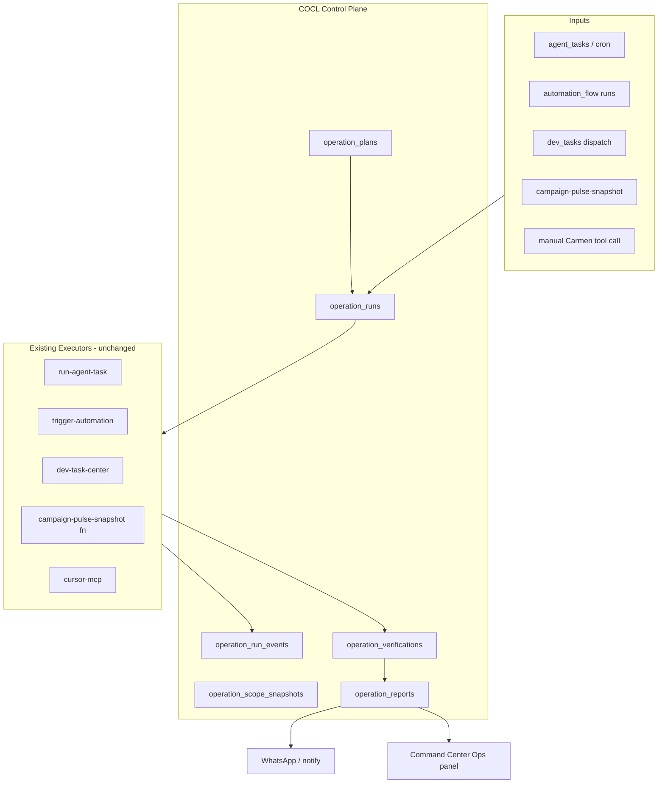
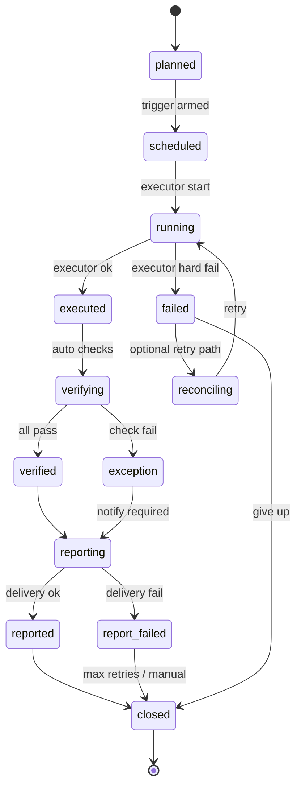
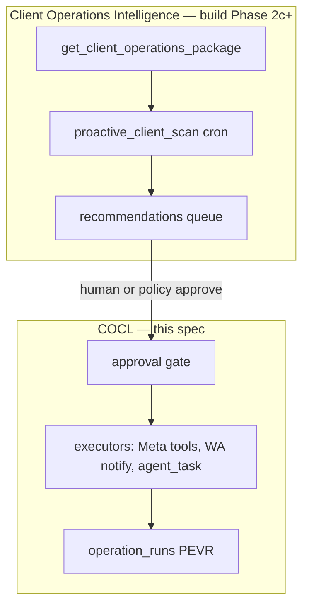

# Campaign Operations Control Layer (COCL)

> **Status:** Phase 0 design + Phase 2c Client 360 + **Phase 1a** (schema, `operation-control-center`, CC «ריצות COCL», dev dispatch → run) on feature branch / PR #711. Target: Staging (`develop`) first.  
> **Author:** Cursor Cloud Agent (dev task `a8507dc8-d63c-4a7b-8d27-795833ab786e`)  
> **Date:** 2026-09-22  
> **Related:** `docs/orchestration-studio-plan.md`, `docs/carmen-reliability-plan.md`, `docs/goal-execution-mode.md`, `docs/carmen-command-center.md`

---

## 1. Executive summary

Carmen needs a **single operational control layer** that answers, for every scheduled or requested operation:

| Question | Must be answerable without guessing |
|----------|--------------------------------------|
| What was **planned** (scope, time, owner, approvals)? | Yes |
| What **executed** (tools, side effects, artifacts)? | Yes |
| What was **verified** (system truth vs intent)? | Yes |
| What was **reported** (WhatsApp / CC / audit)? | Yes |
| What **exceptions** remain open? | Yes |

Today these concerns are split across `agent_tasks`, `trigger-automation` / flow steps, `campaign-pulse-snapshot`, `dev_tasks`, `cursor_dispatches`, and ad-hoc WhatsApp replies. That split caused two recent production-adjacent incidents on Staging/WhatsApp:

1. **Binat 20:30 campaign shutdown** — job scope was too narrow; reporting did not proactively surface remaining active campaigns for the client.
2. **Cursor dev dispatch** — tool returned a schema/linking error while the Cloud Agent session was actually created; Carmen reported failure until manual correction. **Mitigation shipped in PR #709** (`reconcileDevTaskCursorDelivery`, `delivered` / `userStatus` / `reconciled` on `dispatch_dev_task`). COCL **generalizes** that pattern to all operational runs, not only dev tasks.

COCL does **not** replace Orchestration Studio (long-term DAG unification). It is a **thin control plane** that wraps existing executors with explicit **plans**, **runs**, **verification**, and **reporting** records.

**North star (product):** Carmen sees a **full client picture** — group WhatsApp (Manus), client-card updates, pulse/campaign results — and **proactively** surfaces “something needs doing” (contact client, pause campaigns, optimize, escalate). She **logs** every step and **requests approval** before promotional/mutating actions. COCL is the **Execute → Verify → Report → Audit** spine under that intelligence layer (§22).

---

## 2. Goals and non-goals

### Goals

- Unified **PEVR** lifecycle: **P**lanned → **E**xecuted → **V**erified → **R**eported (+ **Exception** branches).
- **Scope contracts** on campaign checks/actions (client IDs, campaign filters, action type, “must mention if still active”).
- **Exception detection** when execution results contradict scope (e.g. shutdown job ran but N campaigns still `ACTIVE`).
- Reliable **WhatsApp/admin reporting** with idempotent delivery keys and “exception-first” summaries.
- **Dev-agent reconciliation** as a first-class verification step (Cursor today; Grok/Manus later).
- **Command Center** operational view: today’s runs, open exceptions, drill-down to events.
- Reuse existing tables and approval gates; additive schema only on Staging until QA sign-off.

### Non-goals (Phase 0–1)

- Replacing `trigger-automation` or merging schedulers (see Orchestration Studio Phase D).
- Auto-running campaign **analysis** LLM paths unless explicitly scheduled or requested (aligns with `carmen-reliability-plan.md`).
- Production schema deploy or Production WhatsApp delivery changes without David’s **`מאשר לפרודקשן`**.

---

## 3. Architecture overview



**Principle:** Executors stay dumb; COCL owns **intent**, **observed outcome**, and **human-facing status**.

---

## 4. Core concepts

### 4.1 Operation plan (`operation_plans`)

A **durable definition** of a recurring or one-shot operation Carmen (or an admin) expects to run.

Examples:

- `binat_daily_campaign_shutdown_2030` — client scope Binat, action `pause_non_exempt_campaigns`, report if any `ACTIVE` remain.
- `weekly_pulse_sunday_0700` — tenant-wide pulse snapshot + digest delivery.
- `dev_task_dispatch` — implicit plan auto-created per `dev_tasks` row when `dispatch_dev_task` runs.

Key fields:

| Field | Purpose |
|-------|---------|
| `slug` | Stable idempotency key per tenant |
| `operation_type` | `campaign_action`, `pulse_check`, `report_delivery`, `dev_dispatch`, `custom_agent_task`, … |
| `scope_json` | **Scope contract** (see §6) |
| `schedule_json` | Link to `agent_tasks.id`, cron, or automation trigger id |
| `approval_policy` | `none`, `human_required`, `reuse_agent_approval_queue` |
| `reporting_policy` | channels, templates, exception-only vs always |
| `enabled` | Kill switch without deleting history |

### 4.2 Operation run (`operation_runs`)

One **instance** of a plan (or ad-hoc run with `plan_id` null).

| Field | Purpose |
|-------|---------|
| `status` | State machine (§5) |
| `planned_at` / `started_at` / `finished_at` | Timestamps |
| `trigger_source` | `scheduler`, `carmen_tool`, `automation`, `manual_ui` |
| `executor_ref` | `{ type, id }` — e.g. `agent_task:uuid`, `dev_task:uuid`, `automation_log:uuid` |
| `scope_snapshot_id` | Frozen scope at start |
| `verification_status` | `pending`, `passed`, `failed`, `skipped` |
| `exception_count` | Denormalized for CC list |
| `idempotency_key` | `(tenant_id, plan_id, window_start)` unique |

### 4.3 Operation run events (`operation_run_events`)

Append-only audit (like `dev_task_events` / `goal_events`):

- `planned`, `dispatched`, `executor_started`, `executor_finished`, `verification_started`, `verification_passed`, `verification_failed`, `report_queued`, `report_delivered`, `report_failed`, `exception_opened`, `exception_resolved`, `reconciled`, `retry_scheduled`.

### 4.4 Verification (`operation_verifications`)

Structured check results separate from executor logs:

```json
{
  "checks": [
    {
      "id": "active_campaigns_empty",
      "expected": { "client_id": "…", "delivery_status_not_in": ["active"] },
      "actual": { "active_count": 2, "campaign_ids": ["…"] },
      "passed": false,
      "severity": "critical"
    }
  ],
  "summary": "2 campaigns still active after shutdown job"
}
```

### 4.5 Report (`operation_reports`)

What Carmen (or the system) told humans:

- `channel` (`whatsapp`, `command_center`, `email`)
- `recipient_ref` (phone, user_id, group)
- `body_digest` (short)
- `full_payload_ref` (link to dashboard / stored markdown)
- `delivery_status`, `provider_message_id`, `idempotency_key`

---

## 5. Status state machine



**Carmen-facing rollup** (for tools/UI):

| Rollup | Meaning |
|--------|---------|
| `on_track` | `planned` … `executed` without exception |
| `needs_attention` | `exception`, `report_failed`, or `failed` with open retry |
| `complete` | `closed` and no open exceptions |

**Dev dispatch mapping (today, Phase 0):**

| COCL state | `dev_tasks` + dispatch result |
|------------|-------------------------------|
| `running` | MCP call in flight |
| `executed` | `delivered=true` (possibly after reconcile) |
| `exception` | `verificationFailed=true` after reconcile exhausted |
| `verified` | session linked + optional PR webhook later |
| `reported` | Carmen told David using `userStatus` string |

---

## 6. Scope contract (campaign operations)

Every campaign-related plan/run MUST persist a **scope snapshot** (`operation_scope_snapshots.scope_json`):

```typescript
type CampaignOperationScope = {
  version: 1;
  tenant_id: string;
  client_ids: string[];           // required for client-specific jobs
  client_names?: string[];        // display only
  campaign_filter?: {
    platform?: "meta" | "google" | "all";
    name_contains?: string[];
    ids?: string[];
    delivery_status?: string[];
    exempt_campaign_ids?: string[]; // e.g. always-on brand campaigns
  };
  action: {
    type: "pause" | "enable" | "budget_change" | "pulse_read" | "analyze" | "custom";
    mutates_platform: boolean;   // if true → approval queue required
  };
  postconditions: {
    /** Verification rules run after execute */
    assert_no_active_campaigns?: boolean;
    assert_pulse_fresh_within_minutes?: number;
    must_report_if_non_empty?: "active_campaigns" | "exceptions" | "always";
  };
  reporting: {
    audience: ("owner" | "campaigner" | "david")[];
    whatsapp_template_key?: string;
    include_dashboard_link?: boolean;
  };
};
```

**Binat incident prevention:** a shutdown plan with `postconditions.assert_no_active_campaigns: true` forces verification to fail and reporting to **lead with remaining actives**, even if the job “completed successfully.”

**Pulse vs analyze:** scope with `action.type: pulse_read` MUST NOT invoke `analyze_campaign_performance` (enforced in executor wrapper + Carmen tool guard).

---

## 7. Integration with existing entities

| Existing entity | COCL role |
|-----------------|-----------|
| `agent_tasks` | Schedule source; `operation_plans.schedule_json.agent_task_id`; each firing creates `operation_runs.executor_ref`. |
| `automation_flow` / logs | Same pattern with `automation_log` ref. |
| `campaign_pulse_snapshots` | Verification input for pulse runs; link `snapshot_id` on run. |
| `dev_tasks` / `dev_task_events` | Dev dispatch runs; map dispatch result fields into verification (session delivered). |
| `cursor_dispatches` / `cursor_task_sessions` | Reconciliation sources (already used in `reconcileDevTaskCursorDelivery`). |
| `agent_approval_queue` | Mutations with `mutates_platform: true` block `running` until approved. |
| `goals` / `goal_events` | Optional `goal_id` on plan/run for Goal Execution Mode reporting. |
| `record_action_episode` | After `reported`, Carmen still records episodic memory (unchanged). |

**Strangler alignment:** COCL tables are authoritative for **operational status**; legacy status columns remain until Phase 3 deprecation.

---

## 8. Data model (proposed migrations)

### 8.1 Tables

```sql
-- operation_plans: definition + scope template
-- operation_scope_snapshots: immutable JSON at run start
-- operation_runs: instance + status machine
-- operation_run_events: append-only
-- operation_verifications: check results (1:1 or 1:n with runs)
-- operation_reports: outbound human messages
-- operation_exceptions: open issues (optional normalize from failed checks)
```

Suggested indexes:

- `(tenant_id, status, planned_at desc)` on `operation_runs`
- `(tenant_id, idempotency_key)` unique where not null
- `(operation_run_id, created_at)` on events

RLS: same tenant membership pattern as `dev_tasks`.

### 8.2 Enum types (or text + check)

`operation_type`, `operation_run_status`, `verification_status`, `report_channel`.

### 8.3 Views (Phase 2)

- `v_operation_runs_today` — CC dashboard
- `v_open_operation_exceptions` — alerting

---

## 9. APIs and Carmen tools

Edge function: **`operation-control-center`** (JWT, mirror `dev-task-center` / `goal-execution-center`).

| Action | Description |
|--------|-------------|
| `list_plans` | Filter by type, enabled |
| `get_plan` | Include last N runs |
| `create_plan` / `update_plan` | Admin; Carmen read-only unless approved |
| `list_runs` | Filters: date, status, client_id, exception_only |
| `get_run` | Events + verification + reports |
| `start_run` | Manual/ad-hoc with scope snapshot |
| `cancel_run` | Soft cancel if not yet mutating |
| `verify_run` | Re-run verification hooks |
| `report_run` | Idempotent WhatsApp/CC report from template |

**Carmen tools (Phase 1):**

| Tool | When |
|------|------|
| `list_operation_runs` | “מה רץ היום?”, “יש חריגות?” |
| `get_operation_run_report` | Drill-down |
| `create_operation_plan` | David defines recurring check (approval) |
| `trigger_operation_run` | Explicit manual run with scope |
| `resolve_operation_exception` | Mark handled + optional note |

**Existing tools (until COCL ships):** keep using `get_latest_campaign_pulse`, `list_dev_tasks`, `dispatch_dev_task` (read `userStatus`), `get_execution_goal_report`.

---

## 10. Executor wrappers (Phase 1–2)

Thin hooks—no business logic duplication:

1. **`cocl-run-begin`** — create run + scope snapshot; check approval; emit `planned` → `running`.
2. **`cocl-run-finish`** — executor callback with result payload; emit `executed` or `failed`.
3. **`cocl-run-verify`** — run postconditions (SQL + pulse snapshot + Meta read-only APIs).
4. **`cocl-run-report`** — build digest; call existing `carmen-notify` / WhatsApp queue with idempotency.

Integration points:

| Executor | Hook location |
|----------|----------------|
| `dispatch-agent-tasks` | Before/after `run-agent-task` invoke |
| `run-agent-task` | On completion callback |
| `dev-task-center` `dispatch` | Already returns verification fields — map to COCL event |
| `campaign-pulse-snapshot` | After snapshot + delivery claim |
| `trigger-automation` | Step boundary for agent/campaign steps |

---

## 11. Cursor / dev-agent dispatch reconciliation (detailed)

**Problem:** MCP `tools/call` may time out (30s), return partial JSON, or surface schema errors while `cursor-mcp` already persisted `cursor_dispatches` and started the agent.

**Current fix (PR #709 — implement on Staging):**

- `reconcileDevTaskCursorDelivery` polls `cursor_dispatches` + `cursor_task_sessions` (4×2s).
- Match on `dev_task_id` in context, title similarity, time window.
- `dispatch_dev_task` returns `delivered`, `reconciled`, `userStatus` — Carmen MUST prefer `userStatus` over raw error text.

**COCL extensions (Phase 1):**

| Enhancement | Detail |
|-------------|--------|
| Durable **`dispatch_attempts`** row | Created *before* MCP call; status `pending` → `confirmed` / `lost` |
| **`reconcile-dev-dispatch` cron** | Every 2 min: `pending` attempts older than 30s → reconcile; emit `operation_run_events.reconciled` |
| **Cursor Cloud API backstop** (optional Phase 2) | List agents by repo + created_after; match `dev_task_id` in prompt |
| **Never say “failed”** if `delivered \|\| reconciled` | Enforced in tool response schema + Carmen skin |
| **Link PR verification** | Webhook or polling sets `verified` when PR URL attached |

**User-visible messages (Hebrew examples):**

- Delivered after timeout: «המשימה נפתחה ב-Cursor (אימות לאחר עיכוב). קישור: …»
- True failure: «לא אומת מסירה ל-Cursor. לא לפתוח כפילות — retry או attach_dev_task_session.»

---

## 12. Alerting rules

| Rule | Condition | Audience | Channel |
|------|-----------|----------|---------|
| `exception_critical` | Verification failed + severity critical | Owner + David | WhatsApp + CC alert face |
| `report_delivery_failed` | `report_failed` after retries | Ops | CC + log |
| `scope_mismatch` | Executor touched client outside scope | Security | Audit + block |
| `stale_pulse` | Scheduled pulse run but snapshot age > SLA | Campaigners | Digest footnote |
| `open_dev_unverified` | Dev run `executed` but no session after 10 min | David | CC dev panel |

Alert dedup: `(tenant_id, rule_id, run_id, exception_fingerprint)` — reuse pulse delivery claim pattern (`claim_campaign_pulse_delivery`).

---

## 13. Failure, retry, reconciliation

| Scenario | Behavior |
|----------|----------|
| Executor transient error | Exponential backoff (3 attempts); `retry_scheduled` event |
| Verification fail | Open `operation_exceptions`; do NOT auto-retry mutate |
| WhatsApp fail | Queue retry; idempotency prevents duplicate sends |
| Cursor dispatch timeout | Reconcile loop + cron backstop |
| Partial campaign shutdown | Exception + proactive WhatsApp listing remaining actives |
| Staging safety | `environment_sync.safety.outbound_blocked` gates external mutate + WA |

---

## 14. Permissions and approval boundaries

- **Read runs/plans:** tenant members with Command Center access (existing RLS).
- **Create/change plans:** David / `COMMAND_CENTER_ALLOWLIST` / role `admin`.
- **Mutating campaign actions:** MUST pass `agent_approval_queue` when `scope.action.mutates_platform=true` — COCL `running` blocked until approval row `approved`.
- **Carmen autonomous:** read-only ops visibility + report retry; no new widen of Meta mutate tools.
- **Audit:** all state transitions in `operation_run_events`; sensitive actions also `claude_carmen_audit` when autonomous prod fix (unchanged policy).

---

## 15. Command Center UI

New header mode **«תפעול»** (or sub-panel under existing **משימות**):

| Widget | Data |
|--------|------|
| Today timeline | `operation_runs` + events |
| Exceptions banner | count + top 3 |
| Run detail drawer | scope snapshot, verification JSON, reports, link to dev session / pulse snapshot |
| Plan editor | Admin only; forms for scope JSON with validation |

Reuse `HudPanel` + `useCommandData` patterns from `docs/carmen-command-center.md`.

Realtime: `postgres_changes` on `operation_runs` (like `agent_tasks`).

---

## 16. WhatsApp reporting rules

1. **Exception-first:** if verification failed, first line states the exception count + client name.
2. **No false success:** never “הכול כבוי” if postcondition checks show actives (Binat case).
3. **Pulse on WA:** continue `whatsapp_digest` only for pulse (existing skill); link to dashboard for detail.
4. **Idempotency:** one report per `(run_id, channel, recipient)` unless `force=true` admin.
5. **Dispatch:** use `userStatus` from `dispatch_dev_task`; mention reconcile explicitly when `reconciled=true`.

---

## 17. Phased implementation plan

| Phase | Scope | Deliverables | QA gate |
|-------|--------|--------------|---------|
| **0 (this PR)** | Design doc + Carmen skin for PEVR discipline | `docs/campaign-operations-control-layer.md`, skin migration, learned-skills entry | Review with David |
| **1a** | Schema + read API + CC read-only list | Migrations on Staging, `operation-control-center` list/get, map dev dispatch → run | Unit tests + CC manual |
| **1b** | Dev dispatch COCL wrapper | Every `dispatch_dev_task` creates/links run; cron reconcile | Replay timeout scenario |
| **2a** | Campaign scope + verification | Binat shutdown plan as code; postcondition checks | `scripts/qa-binat-campaign-shutdown.mjs` + staging dry run |
| **2b** | Agent task + pulse hooks | Wrap `dispatch-agent-tasks` + pulse delivery | Sunday pulse Staging |
| **3** | Plan editor + alerting + Orchestration merge prep | Unified scheduler view | Staging 1 week soak |
| **Prod** | After **`מאשר לפרודקשן`** | Migrations + edge deploy | Compare Staging exceptions = 0 critical |

Each phase: feature branch → PR to `develop` → Vercel Preview → David verification.

---

## 18. QA checklist

### Dev dispatch reconciliation

- [ ] Simulate MCP timeout; confirm `delivered=true`, `reconciled=true`, Hebrew `userStatus`.
- [ ] Carmen does not open duplicate `dev_tasks` on reconciled success.
- [ ] True failure (no row in `cursor_dispatches`) → `verificationFailed`, clear retry guidance.

### Campaign shutdown scope

- [ ] Plan scope includes all Binat client campaigns per test matrix (`client-campaign-shutdown.test.mjs`).
- [ ] With actives remaining, verification fails and WhatsApp mentions count + names (Staging phone sandbox).

### Pulse

- [ ] Scheduled pulse creates run; verification checks snapshot freshness.
- [ ] WA digest idempotent on double cron tick.

### Permissions

- [ ] Non-admin cannot create mutating plan without approval.
- [ ] Cross-tenant run invisible (RLS).

### Command Center

- [ ] Today view lists runs; exception banner matches open exceptions.
- [ ] Click-through to dev session URL works.

---

## 19. Risks and migration notes

| Risk | Mitigation |
|------|------------|
| Dual status (`agent_tasks.status` vs COCL) | COCL is read-model + events first; deprecate later |
| Scheduler duplication | Phase 3 aligns with Orchestration single scheduler |
| Over-alerting | Dedup keys + severity thresholds |
| Schema drift Staging/Prod | Migrations only after Staging soak |
| Carmen prompt overload | Skin + short tool responses; link to CC for detail |

**Migration:** backfill optional — create `operation_plans` for known crons (Binat job, pulse Sunday) without historical runs; forward-only from deploy time.

---

## 20. Gaps / missing integrations (track before build)

| Gap | Owner phase |
|-----|-------------|
| Cursor Cloud Agents list API for backstop reconcile | 1b/2 |
| Standard webhook PR → `dev_tasks.pr_url` → COCL verified | 1b |
| Unified `notifications` table (today pulse uses queue helpers) | 2b |
| `agent_tasks` update/cancel APIs (capability audit) | 2a |
| Orchestration single scheduler | 3 |
| Production `pulse_alert_rules` completeness | ops (see reliability plan) |

---

## 22. Client 360 + proactive operations (product alignment)

### 22.1 What David wants

For each client, Carmen should **synthesize** (not guess):

| Signal | Source (today / planned) |
|--------|---------------------------|
| Campaign KPIs, trends, critical alerts | `campaign_pulse_snapshots`, `campaign_alerts`, `get_latest_campaign_pulse` |
| Client-card timeline (calls, weekly updates, notes) | Client updates / CRM sync (`resolveClientUpdateType`, pulse call rules) |
| Group WhatsApp (Manus) | Groups where Carmen is a member; map via `carmen_client_group_access` only (never full `whatsapp_groups` for permissions) |
| Group WhatsApp (Green API / CRM) | **Read-only** via `get_client_green_group_communications` — `clients.whatsapp_group_id` + `chat_messages.provider=green_api`. Report unanswered client questions; **never auto-reply** in those groups |
| Tasks, goals, open approvals | `tasks`, `goals`, `agent_approval_queue` |
| What already ran / failed | COCL `operation_runs` (Phase 1+) |

Then **proactively** (on schedule or trigger): detect gaps — e.g. weak ROAS + no call in 14 days + angry message in group → recommend **contact client**; end-of-day rule → **verify shutdown**; disapproved ad → **notify + fix path**. Carmen proposes; **she does not mutate ads or send client-facing messages** without approval where policy requires it.

### 22.2 Two-layer architecture



- **Intelligence:** cheap, mostly **non-LLM** rules on fresh facts (aligned with `carmen-reliability-plan.md`); LLM only for ambiguous “what to say to client” drafts **after** a recommendation exists.
- **COCL:** every approved action becomes a **run** with scope, verification, and report — so “כרמן אמרה שכיבתה” always matches DB + Meta truth.

### 22.3 Signal → Playbook (implementation)

**Canonical spec:** `docs/client-ops-signal-framework.md` — detectors emit `signal_kind` + `problem_summary`; tenant rows in `client_ops_playbooks` define assignee, task templates, verification checks, and `auto_execute`.

### 22.4 Proactive playbook examples (configurable per tenant)

| Trigger | Suggested action | Mutating? | Approval |
|---------|------------------|-----------|----------|
| Staff promised action in Green group, no follow-up | `create_commitment_followup` → `tasks` + `client_updates` | No (internal CRM) | Auto |
| Weekly update sent in Green group, missing on card | `sync_weekly_update_from_green_group` (dry_run then write) | No (card only) | Carmen / David |
| Pulse critical: stopped campaign | WhatsApp to campaigner + David | No | Auto notify |
| Scheduled 20:30 client shutdown | Pause campaigns in scope | Yes | Pre-approved plan or daily confirm |
| CPL above target 7d + no client call | “Call client” task + draft WA to David | No / draft only | Notify |
| Group @כרמן or client escalation phrase | Reply in thread | Maybe | Per `carmen_access_policies` |
| Optimization request from David | `analyze_campaign_performance` scoped | No* | Explicit request only |

\*Analysis is read-only but costly — not auto-fired on every pulse tick.

### 22.4 Carmen tools (incremental)

| Tool | Phase | Role |
|------|-------|------|
| `get_client_operations_package(client_id)` | 2c | Single JSON: pulse row, last calls/updates, open alerts, recent Manus group snippets (permission-filtered), open COCL exceptions |
| `list_client_recommendations` | 2c | Proactive queue with status `open` / `accepted` / `dismissed` |
| `propose_client_action` | 2c | Creates recommendation + optional `agent_approval_queue` row for mutate/send |
| Existing `execute_pending_approval` / Meta fb_* | Now | Execute after David approves |
| `record_action_episode` | Now | Memory after real execution |

### 22.5 UI

- **Client card:** tab **«כרמן / תפעול»** — timeline merging card updates + COCL runs + recommendations.
- **Command Center:** client filter on **תפעול** panel; proactive banner “3 clients need attention”.

### 22.6 Phased add-on (after COCL 2b)

| Phase | Deliverable |
|-------|-------------|
| **2c** | `get_client_operations_package` + recommendation table + rule-based scan (no auto Meta mutate) |
| **2d** | Group message ingestion into package (Manus); link to client |
| **3** | CC client tab + approval UX from recommendations |

---

## 21. References (code)

- Dev task reconciliation: `supabase/functions/_shared/dev-tasks.ts` (`reconcileDevTaskCursorDelivery`, `buildDispatchUserStatus`)
- Pulse delivery idempotency: `claim_campaign_pulse_delivery` RPC
- Campaign shutdown tests: `supabase/functions/_shared/client-campaign-shutdown.test.mjs`
- Prior art: `docs/orchestration-studio-plan.md`, `docs/multitask-design.md`
