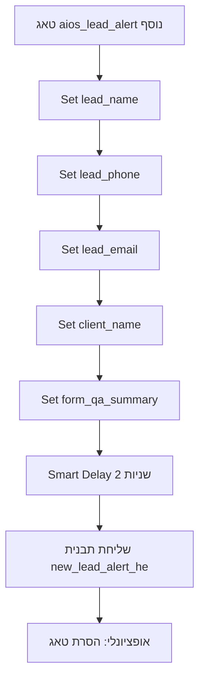

# מדריך: תיקון Flow התראת ליד ב-ManyChat (DMM 77)

מטרה: כשאיש קשר **כבר קיים** ב-ManyChat (בדיקות חוזרות, אותו מספר טלפון), התבנית תציג את **הליד הנוכחי** — לא פרמטרים מהבדיקה הקודמת.

AIOS כבר:
- כותב את 5 השדות דרך API
- מסיר ומוסיף טאג `aios_lead_alert`

**מה שחסר:** בתוך ManyChat, ה-Flow חייב **לרענן את השדות** לפני שליחת התבנית. אין API לזה — עושים פעם אחת ב-UI.

---

## לפני שמתחילים

| פריט | ערך |
|---|---|
| עמוד ManyChat | **DMM-WA** |
| Flow קיים | **ליד חדש ללקוח** (`content20260805211918_552368`) |
| טאג | `aios_lead_alert` |
| תבנית WhatsApp | `new_lead_alert_he` |
| שדות (User Fields) | `client_name`, `lead_name`, `lead_phone`, `lead_email`, `form_qa_summary` |

---

## מבנה ה-Flow הנכון (סקירה)

---

## שלב 1 — פתיחת ה-Flow

1. היכנס ל-[ManyChat](https://app.manychat.com) → בחר עמוד **DMM-WA**.
2. בתפריט שמאל: **Automations** (או **Flows**).
3. חפש Flow בשם **«ליד חדש ללקוח»** ולחץ **Edit** / **עריכה**.
4. ודא שב-URL או בהגדרות מופיע מזהה: `content20260805211918_552368`.

> **טיפ:** אם יש **גם** אוטומציה נפרדת (Rules) על טאג `aios_lead_alert` **וגם** Flow שנקרא ישירות — ערוך את זה שמופעל מ-**Tag applied**.

---

## שלב 2 — בדיקת הטריגר

1. לחץ על צומת ההתחלה (Start / Trigger).
2. הטריגר צריך להיות אחד מאלה:
   - **Tag applied** → `aios_lead_alert` ✅ (מומלץ — כך AIOS מפעיל היום)
   - או **External / API** אם השתמשת ב-sendFlow בעבר

אם הטריגר הוא רק sendFlow ואין טאג — הוסף אוטומציה חדשה:
**Automations → + New → Trigger: Tag applied → `aios_lead_alert`**

---

## שלב 3 — הוספת 5 פעולות «Set Custom Field» (החלק הקריטי)

**לפני** צומת שליחת התבנית, הוסף 5 פעולות. כל פעולה מאלצת את ManyChat לקרוא מחדש את הערך — גם על איש קשר קיים.

לכל שדה:

1. לחץ **+** (Add action) **לפני** שליחת התבנית.
2. בחר: **Actions** → **Set Custom Field** (או «הגדר שדה מותאם»).
3. **Field to set:** בחר את שם השדה (למשל `lead_name`).
4. **Value:** בחר **User Field** (שדה משתמש) → **אותו שם** (`lead_name`).
   - לא «טקסט קבוע»
   - לא «Flow Field»
   - לא `First Name` של המערכת
5. שמור את הצומת.

חזור על זה **5 פעמים**:

| # | Field to set | Value (User Field) |
|---|---|---|
| 1 | `lead_name` | `{{lead_name}}` / User Field `lead_name` |
| 2 | `lead_phone` | `lead_phone` |
| 3 | `lead_email` | `lead_email` |
| 4 | `client_name` | `client_name` |
| 5 | `form_qa_summary` | `form_qa_summary` |

> למה «שדה מעצמו»? זה נראה מיותר, אבל ב-ManyChat זה מרענן את שכבת התבנית על contacts ישנים. בלי זה רואים «ליד א» / «שאלה?: תשובה» מהבדיקה הקודמת.

---

## שלב 4 — Smart Delay

1. אחרי 5 פעולות ה-Set Field, לחץ **+**.
2. בחר: **Timing** → **Smart Delay** (או **Wait**).
3. הגדר **2 שניות**.
4. שמור.

---

## שלב 5 — מיפוי תבנית WhatsApp (בדיקה כפולה!)

1. לחץ על צומת **Send WhatsApp Message** / **שלח הודעת WhatsApp**.
2. תבנית: **`new_lead_alert_he`** (מאושרת על ערוץ DMM 77).
3. מיפוי פרמטרים — **חייב להיות בדיוק כך:**

| פרמטר בתבנית | שדה ב-ManyChat | מה מוצג ב-WhatsApp |
|---|---|---|
| `{{1}}` | User Field **`client_name`** | שם קמפיין / לקוח (כותרת) |
| `{{2}}` | User Field **`lead_name`** | **שם הליד** (לא client_name!) |
| `{{3}}` | User Field **`lead_phone`** | טלפון הליד |
| `{{4}}` | User Field **`lead_email`** | אימייל הליד |
| `{{5}}` | User Field **`form_qa_summary`** | שאלות סינון |

### טעויות נפוצות (מה שראינו אצל שניה)

| סימפטום בהודעה | סיבה |
|---|---|
| תחת «שם» מופיע שם הקמפיין | `{{2}}` ממופה ל-`client_name` במקום `lead_name` |
| טלפון / אימייל ריקים | `{{3}}` / `{{4}}` לא מחוברים בכלל |
| שאלות סינון נכונות אבל שם לא | רק `{{5}}` ממופה נכון — השאר לא |

---

## שלב 6 — אפשרויות נוספות

1. **Allow multiple times** — האוטומציה חייבת לרוץ **יותר מפעם אחת** לאותו contact (לא Once only).
2. **אופציונלי:** אחרי השליחה → **Remove Tag** → `aios_lead_alert`.
3. לחץ **Publish** / **Activate** / **שמור ופרסם**.

---

## שלב 7 — בדיקה

### א. בדיקה על איש קשר קיים (המקרה הבעייתי)

1. ב-ManyChat → **Contacts** → חפש מספר בדיקה (למשל `972507677613`).
2. שלח טסט מ-Make עם:
   - `client_phone` = אותו מספר
   - `lead_name` = ערך **חדש וברור** (למשל `בדיקה 17:00`)
3. בדוק בהודעת WhatsApp:
   - **שם** = `בדיקה 17:00` (לא שם מבדיקה קודמת)
   - **טלפון / אימייל** = מה שנשלח עכשיו
   - **שאלות סינון** = מה שנשלח עכשיו

### ב. בדיקה על מספר חדש

1. שלח עם `client_phone` שלא נבדק מעולם.
2. אמור לעבוד גם בלי היסטוריה — אם רק מספרים חדשים עובדים, חסר שלב 3 (Set Fields).

### ד. שלחת שני טסטים מהר והשני לא הגיע?

**כן — זה בדרך כלל מרוץ על הטאג.**

ManyChat מפעיל את ה-Flow רק כשהטאג **נוסף** לאיש קשר. אם הטאג `aios_lead_alert` עדיין עליך (ה-Flow הקודם עדיין רץ, או שהסרת הטאג בסוף ה-Flow לא הסתיימה), `addTag` שני **לא מפעיל** שוב את האוטומציה.

AIOS עושה: הסרת טאג → **ממתין עד שהטאג באמת נעלם** (polling) → הוספת טאג מחדש.

**בבדיקות ידניות:**
- המתן ~10 שניות בין טסט לטסט, **או**
- שלח `external_id` שונה בכל טסט ב-Make (אותו `external_id` = AIOS מדלג כ«כבר עובד»)

---

ב-`automation_logs` של אוטומציה `314a7c5a-d7e3-4b24-9a18-095615906e08`:
- `delivery: "tag"` (לא `sendFlow`)
- `resolved_fields` עם הערכים שנשלחו

---

## Checklist לפני סגירה

- [ ] טריגר: Tag `aios_lead_alert`
- [ ] 5× Set Custom Field (כל שדה ← User Field באותו שם)
- [ ] Smart Delay 2 שניות
- [ ] תבנית `new_lead_alert_he` עם מיפוי `{{1}}`–`{{5}}` נכון
- [ ] `{{2}}` = `lead_name` (לא `client_name`)
- [ ] `{{3}}` ו-`{{4}}` מחוברים
- [ ] Multiple times מופעל
- [ ] Flow פורסם / פעיל
- [ ] טסט על **אותו מספר פעמיים ברצף** עם שמות ליד שונים — השני מציג את החדש

---

## עזרה

אם אחרי כל השלבים עדיין מגיעים ערכים ישנים:
1. שלח צילום מסך של **כל ה-Flow** (מהטריגר עד התבנית).
2. שלח צילום מסך של **מיפוי הפרמטרים** בתבנית (`{{1}}`–`{{5}}`).
3. ציין שעת שליחה — נבדוק ב-`automation_logs` מול ManyChat Contact.

קישורים:
- [הגדרת AIOS המלאה](./manychat-lead-alert-setup.md)
- ManyChat: [WhatsApp Message Templates](https://help.manychat.com/hc/en-us/articles/14281326740124)
