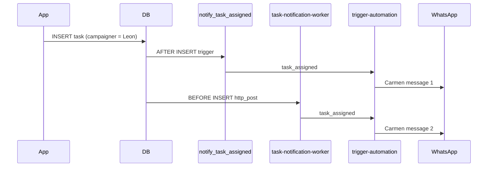

# Postmortem: duplicate Carmen WhatsApp on new task assignment (Felix → Leon)

## Impact

Assignees in Felix (e.g. Leon) received **two** nearly identical Carmen WhatsApp messages for a **single** new task assignment.

## Root cause

Two independent DB paths fired on `INSERT INTO tasks` with a `campaigner_id`:

| Path | Mechanism | Destination |
| --- | --- | --- |
| **Legacy** | `trg_notify_task_assigned` → `notify_task_assigned()` → HTTP `trigger-automation` (`task_assigned`) | Carmen WhatsApp |
| **Current** | `trg_notify_task_notification_worker` → `task-notification-worker` → `claimAndSend` → `trigger-automation` (`task_assigned`) | Carmen WhatsApp |

Migration `20260728143000_add_task_followup_notifications.sql` **dropped** the legacy trigger, but production (and stale `database/schema.sql`) could still run both if the drop never applied or schema was re-applied from an old dump. There was **no idempotency** inside `sendTaskNotificationFromTenantCarmen`, so two HTTP calls meant two sends.

## Fix (PR #703)

1. **`task_notification_deliveries`** — unique `(task_id, notification_type, recipient_key)`; claim before Carmen send in `sendTaskNotificationFromTenantCarmen`.
2. **Migration** — `DROP TRIGGER trg_notify_task_assigned` and `DROP FUNCTION notify_task_assigned()`.
3. **Worker** — release task row markers when delivery fails; do not advance in-memory state on failed sends.
4. **Heartbeat** — stop parallel Green API overdue pings; nudge worker instead.

## Prevention (going forward)

- **Single front door for outbound Carmen task WhatsApp:** only `sendTaskNotificationFromTenantCarmen` sends; all triggers/crons must go through `task-notification-worker` or the same dedupe table.
- **Never reintroduce** `notify_task_assigned` / `trg_notify_task_assigned` on `tasks`.
- **Ops check after deploy:** run `supabase/ops/verify_task_notification_single_path.sql` on Production — expect zero rows for legacy trigger.
- **Schema hygiene:** `database/schema.sql` must not define the legacy trigger (dump is reference-only; migrations are source of truth).
- **New notification types:** add a row to `TASK_NOTIFICATION_TYPES` and use `claimTaskNotificationDelivery` before send.

## Verification

1. Apply migration `20260922160000_fix_duplicate_task_reminder_notifications.sql`.
2. Deploy Edge Functions: `trigger-automation`, `task-notification-worker`, `agent-heartbeat`.
3. Staging: create one task assigned to a campaigner with a phone → exactly **one** Carmen WhatsApp within 2 minutes.
4. Production ops: `verify_task_notification_single_path.sql` → no legacy trigger.
